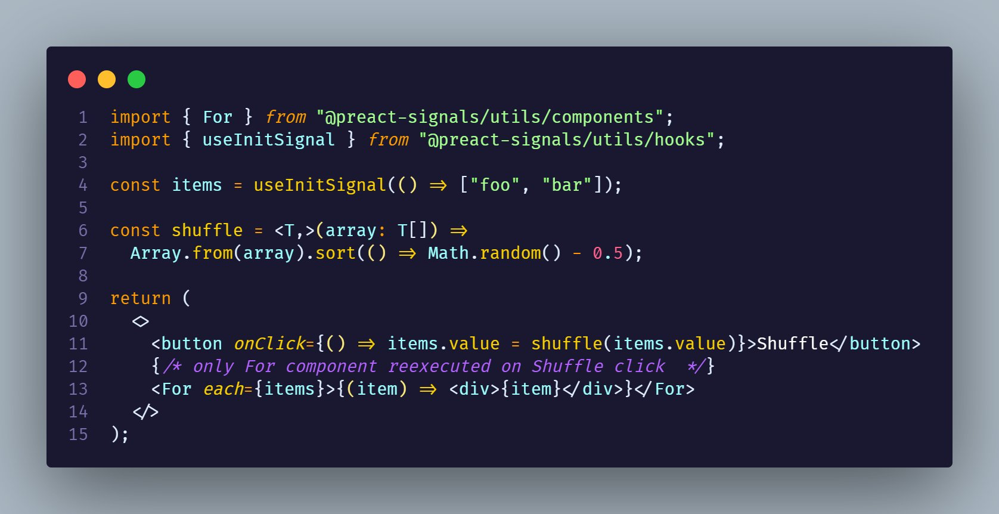

# `@preact-signals` Monorepo

Goal of the project to provide comprehensive tooling for using [`preact/signals`](https://github.com/preactjs/signals)

### Playground:

[ check in stackblitz](https://stackblitz.com/edit/vitejs-vite-h8ib6b?file=src%2FApp.tsx)

## Packages

- [`@preact-signals/utils`](./packages/utils): A package that contains a lot of utils for many purposes. I think it should be kinda stdlib for using preact signals. Utils contains: Solid js like resource, for handling async reactivity, Simple flat store implementation that wraps values into signals getters, Vue deep reactivity tracking, high order components.
- [`@preact-signals/safe-react`](./packages/react): Unofficial `@preact/signals` integration for react, that tries to be bullet proof.
- [`@preact-signals/query`](./packages/query): Tanstack query core preact signals bindings
- [`@preact-signals/unified-signals`](./packages/unified-signals/): This package reexports `@preact/signals-react`, with hooks shims in case of overwriting dependencies. And also polyfills newest preact signals features.

## Contributing

Contributions are welcome!

1. Clone the repository: `git clone https://github.com/XantreDev/preact-signals.git`
2. Install dependencies: `pnpm install`
3. Transpile packages and start vite devservers: `pnpm watch`
4. Make changes
5. Commit changes to new branch
6. Run `pnpm changeset` and make PR

## License

This project is licensed under the [MIT License](LICENSE).
