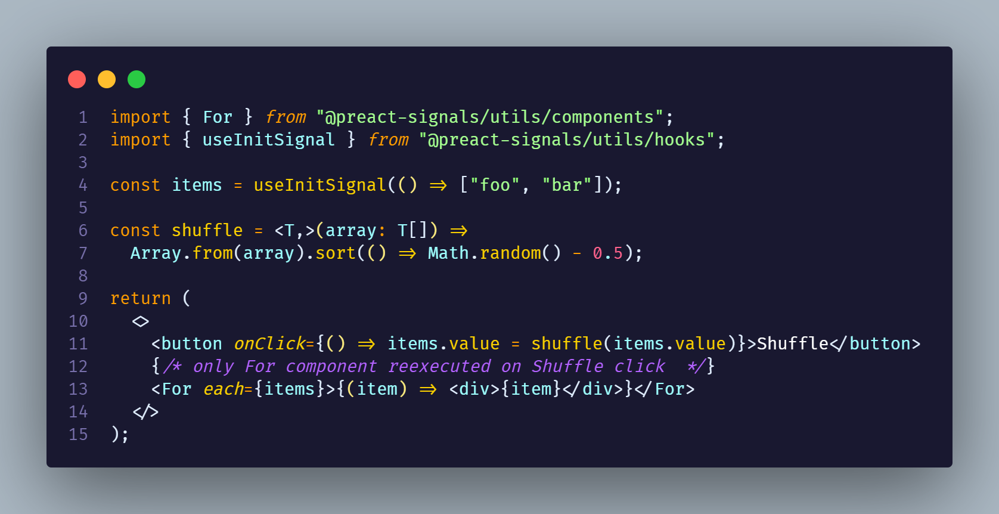

# `@preact-signals/utils`

`@preact-signals/utils` is a standard library for Preact Signals, designed to provide essential utilities for comfortable and streamlined usage. This package includes several features to enhance the flexibility and maintainability of Preact Signal-based projects.

## Split your code because of you **want**, not because of you have to



## Prerequisites

Ensure that [one of the preact signals runtimes](https://github.com/preactjs/signals) is installed:

- `@preact/signals` for `preact`, requiring an [additional step](#preactsignals-additional-step).
- `@preact/signals-core` for vanilla js requiring an additional step.
- `@preact/signals-react` for `react`.

### `@preact/signals-core` additional step:

We need to resolve `@preact/signals-react` as `@preact/signals-core`

#### Vite example:

```ts
import { defineConfig } from "vite";

export default defineConfig({
  resolve: {
    alias: {
      "@preact/signals-react": "@preact/signals-core",
    },
  },
});
```

#### Astro example:

```ts
import { defineConfig } from "astro/config";

// https://astro.build/config
export default defineConfig({
  vite: {
    resolve: {
      alias: {
        "@preact/signals-react": "@preact/signals-core",
      },
    },
  },
});
```

### `@preact/signals` additional step:

Resolve `@preact/signals-react` as `@preact/signals`. For guidance, see [resolve `react` as `preact`](https://preactjs.com/guide/v10/getting-started) and follow a similar process with signals. Additionally, dedupe `preact`.

#### [Vite example](../../apps/preact-test/vite.config.ts):

```ts
import preact from "@preact/preset-vite";
import { defineConfig } from "vite";

export default defineConfig({
  plugins: [preact()],
  resolve: {
    dedupe: ["preact"],
    alias: [
      { find: "react", replacement: "preact/compat" },
      { find: "react-dom/test-utils", replacement: "preact/test-utils" },
      { find: "react-dom", replacement: "preact/compat" },
      { find: "react/jsx-runtime", replacement: "preact/jsx-runtime" },
      { find: "@preact/signals-react", replacement: "@preact/signals" },
    ],
  },
});
```

### Installation

Fetch `@preact-signals/utils` via your preferred package manager:

```bash
# Using npm
npm install @preact-signals/utils

# Using yarn
yarn add @preact-signals/utils

# Using pnpm
pnpm add @preact-signals/utils
```

Library consist from many entries:

- `@preact-signals/utils` for library agnostic utils
- `@preact-signals/utils/components` for reactive components
- `@preact-signals/utils/hooks` for reactive hooks
- `@preact-signals/utils/hocs` provides hocs wrappers that bring reactivity to your components
- `@preact-signals/utils/store` provides deep reactivity implementation
- `@preact-signals/utils/store/hooks` provides deep reactivity implementation

## Main Entry: `@preact-signals/utils`

### `ReactiveRef`/`$`

The `ReactiveRef` type functions similarly to a Preact signal, essentially wrapping a function that can be passed into props or JSX. You can create it using the `$` function.

```tsx
const sig = signal(1);
<div>{$(() => sig.value * 10)}</div>;
```

### `WritableReactiveRef`/`$w`

Creates editable signal from getter and setter functions.

```ts
const a = signal({ a: 1 });
const aField = $w({
  get() {
    return a.value.a;
  },
  set(value) {
    a.value = { a: value };
  },
});

console.log(aField.value); // 1
aField.value = 2;
console.log(aField.value); // 2
console.log(a.value); // { a: 2 }
```

### Deep Reactivity (Port of Vue 3 deep tracking API)

#### `deepSignal`

Takes an inner value and returns a reactive and mutable signal, with deepReactive inside of it.

```typescript
const a = deepSignal({ a: 1, b: 2 });
const c = computed(() => a.value.a + a.value.b);
a.value = { a: 2, b: 3 };
console.log(c.value); // 5

a.value.b = 4;
console.log(c.value); // 6
```

#### Store API

Store API contains Vue-like API for deep reactivity. It's has one significant change: if reactive
wrapper is deep - it will be named with `deep` prefix. So `reacitve` becomes `deepReactive`.

| Vue               | `@preact-signals/utils/store` |
| ----------------- | ----------------------------- |
| `reactive`        | `Store.deepReactive`          |
| `readonly`        | `Store.deepReadonly`          |
| `shallowReadonly` | `Store.shallowReadonly`       |
| `shallowReactive` | `Store.shallowReactive`       |
| `isReactive`      | `Store.isReactive`            |
| `isReadonly`      | `Store.isReadonly`            |
| `isProxy`         | `Store.isProxy`               |
| `toRaw`           | `Store.toRaw`                 |
| `markRaw`         | `Store.markRaw`               |

To use Store API you should wrap your object with `Store.deepReactive` or `Store.shallowReactive`:

```typescript
import { Store } from "@preact-signals/utils";

const a = Store.deepReactive({ a: 1, b: 2 });
const b = Store.shallowReactive({ a: 1, b: 2 });

const c = computed(() => a.value.a + a.value.b + b.value.a + b.value.b);
```

### `reaction`

The `reaction` function allows responding to changes tracked within a dependent function. It is useful for managing side-effects or synchronizing non-reactive parts of your code.

`reaction` is enhanced version of this:

```ts
const reaction = (deps, fn) =>
  effect(() => {
    const value = deps();
    untracked(() => fn(value));
  });
```

```tsx
const sig = signal(1);
const sig2 = signal(2);
// reaction(deps, effect, options?: {memoize: boolean})
const dispose = reaction(
  () => sig.value,
  (value) => {
    // you can read signals here without tracking
    if (sig2.value * 10 === value) {
      sig2.value = value;
    }
  }
);

// will only reexecute reaction if deps result actually changed
reaction(
  () => {
    sig.value;
    return sig2.value;
  },
  () => {
    console.log("reacted");

    return () => {
      console.log("reaction disposed");
    };
  },
  {
    memoize: true,
  }
);
```

### `rafReaction`

Will execute reaction after deps changed on next animation frame. Return dispose function.

```tsx
const sig = signal(1);
const el = document.createElement("div");

rafReaction(
  // deps
  () => sig.value,
  // effect
  (value) => {
    el.style.transform = `translateX(${value}px)`;
  }
);

sig.value = 10;
```

### `accessor`/`setter`

These functions act as wrapper creators for signals, offering a convenient way to separate reading and writing responsibilities.

### `resource`

The `resource` type binds a signal to a promise, including Preact Signals' reactivity. It can be retried, rejected, or resolved, offering a streamlined way to manage asynchronous operations.

```tsx
const [resource, { refetch }] = createResource({
  fetcher: async () => {
    const response = await fetch("https://example.com");
    return response.json();
  },
});

return <Show when={resource}>{(result) => <div>{result()}</div>}</Show>;
```

### `createFlatStore`

This function offers a simple store implementation, converting key values into signals on demand.

> When deep reactivity API will be stable, possibly flat stores will be deprecated

```typescript
const [store, setStore] = createFlatStore({
  a: 1,
  b: 2,
  // computeds will be created from getters
  get c() {
    return this.a + this.b;
  },
});

const c = computed(() => store.a + store.b); // 3
store.a = 2;
store.b = 3;
console.log(store.c); // 5
console.log(c.value); // 5

// will be auto bached
setStore({ a: 3, b: 4 });
console.log(c.value); // 7
```

### `createFlatStoreOfSignals`

This function wraps provided **signals and value** to flat store. You can pass computed's too and it will be readonly field

> When deep reactivity API will be stable, possibly flat stores will be deprecated

```typescript
const [store, setStore] = createFlatStoreOfSignals({
  a: 1,
  b: 2,
  c: signal(10),
  d: computed(() => 10),
  // computeds will be created from getters
  get e() {
    return this.a + this.b;
  },
});

// ok
setStore({
  a: 10,
  b: 11,
  c: 12,
});

setStore({
  // type error and throws
  e: 10,
  d: 10,
});
```

## `@preact-signals/utils/hooks`: Hooks for Signals

This entry provides hooks designed to work with signals, enhancing reactivity and composability in your components.

```typescript
// execute function run only once, and you can access other signals inside without tracking
const a = useInitSignal(() => new Set());
// uses first provided clojure, so it can be jit
const b = useComputedOnce(() => a.value.size);
useSignalEffectOnce(() => a.value.size);

// create flat store from provided value
const [store, setStore] = useFlatStore(() => ({
  a: 1,
  b: 2,
}));

const [store2, setStore2] = useFlatStoreOfSignals(() => ({
  a: 1,
  b: signal(10),
}));

// create resource from provided fetcher
const [resource, { refetch }] = useResource({
  fetcher: async () => {
    const response = await fetch("https://example.com");
    return response.json();
  },
});
```

### Deep Reactivity Hooks

Exports hook which takes as first argument callback which will be applied on the first rended to create reactive
primitive.

#### `useDeepSignal`

Takes creator callback and returns a reactive and mutable signal, with deepReactive inside of it.

```typescript
const a = useDeepSignal(() => ({ a: 1, b: 2 }));
```

There are also: `useDeepReactive`, `useShallowReactive`.

### `useLinkedSignal`

Creates signal that linked to value passed to hook, with unwrapping of signals to avoid `.value.value`

```tsx
// always linked to value passed to hook
const s1 = useLinkedSignal(Math.random() > 0.5 ? 1 : 0);
// 0 | 1
console.log(s1.peek());

const s2 = useLinkedSignal(Math.random() > 0.5 ? signal(true) : false);
// false | true
console.log(s2.peek());

// deeply unwrapping
const s3 = useLinkedSignal(signal(signal(signal(false))));
// false
console.log(s3.peek());
```

## `@preact-signals/utils/components`: Reactive Components

This section includes components like `Show`, `Switch`, `Match`, `For`, allowing you to scope reactivity within your JSX. These components aid in writing more declarative and readable code.
All of this component works with reactive unit, which is Signal or Accessor callback

```tsx
import { Show, For } from "@preact-signals/utils/components";

<Show fallback={<p>Loading...</p>} when={() => arr.value}>
  {(data) => (
    <ul>
      <For each={data} keyExtractor={(item) => item.id}>
        {(item) => <li>{renderItem(item)}</li>}
      </For>
    </ul>
  )}
</Show>;
```

```tsx
import { Switch, Match } from "@preact-signals/utils/components";

<Switch fallback={<p>Not found</p>}>
  <Match when={() => route.value === "home"}>
    <Home />
  </Match>
  <Match when={() => route.value === "about"}>
    <About />
  </Match>
  <Match when={() => route.value === "users"}>
    <Users />
  </Match>
</Switch>;
```

## `@preact-signals/utils/hocs`: High Order Components (HOCs)

HOCs in this entry allow you to inject signals or `ReactiveRef`-s into props, aiding in the creation of reusable and composable logic across various components.

Examples:

```tsx
const View$ = withSignalProps(View);
const Text$ = withSignalProps(Text);
const a = signal(10);
const b = signal(5);

<View$ hitSlop={useComputed(() => a.value + b.value)} />;
<View$ hitSlop={$(() => a.value + b.value)} />;
```

### `reactifyLite`

Makes you component truly reactive. Your props are will be use getter to signals under the hood. So you can safely pass it into effect or reactive component like `Show` or `Switch` without worries about tracking.

```tsx
const Comp = (props: ReactiveProps<{ a: number }>) => (
  <Show when={() => props.a > 10}>{(v) => v + 10}</Show>
);

const B = reactifyLite(Comp);
<B a={$(() => a.value + b.value)} />;

// JSX transform idea. this is just idea, not implemented
// use `$$` to pass props like in SolidJS
<C a$$={a.value + b.value} />;
```

### Heavily inspired by:

- [SolidJS](https://www.solidjs.com/)
- [Vue 3](https://v3.vuejs.org/)

### License

`@preact-signals/utils` is licensed under the [MIT License](LICENSE), and you're free to use, modify, and distribute it under the terms outlined in the LICENSE file.
